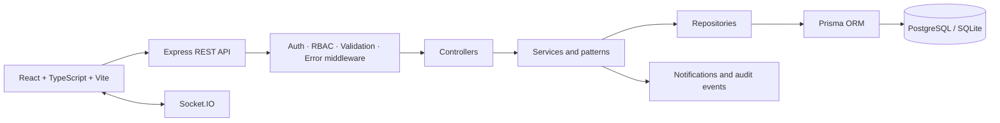
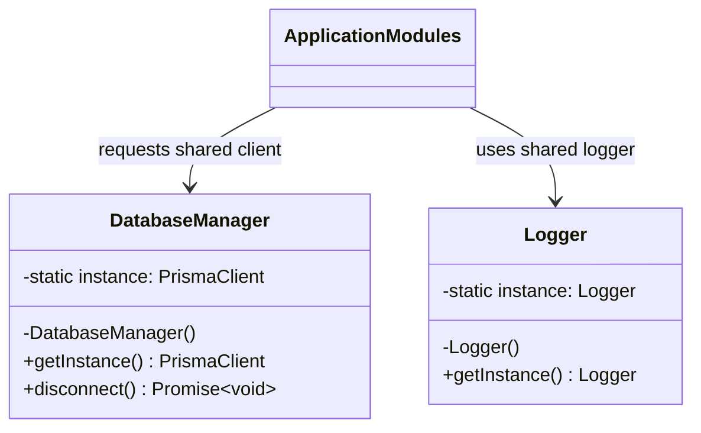
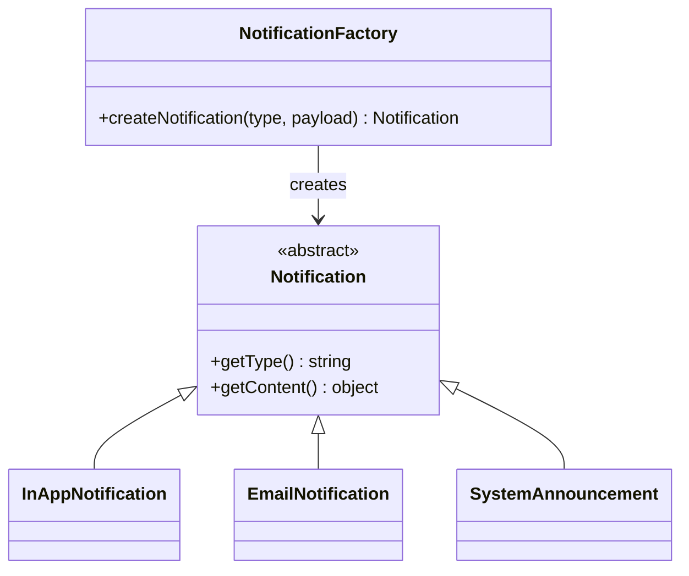
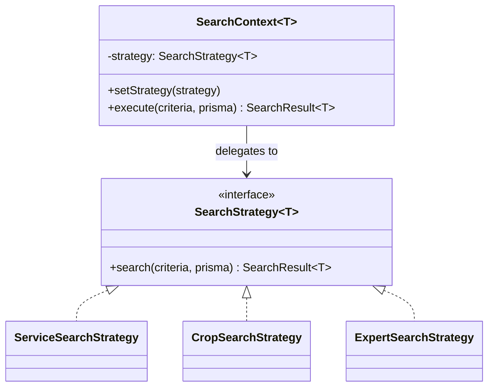
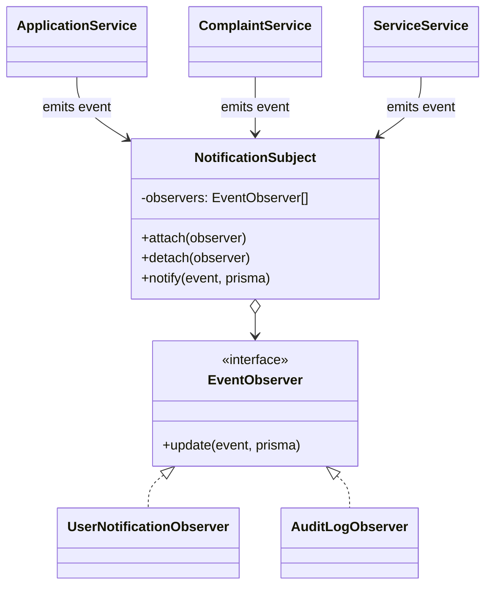
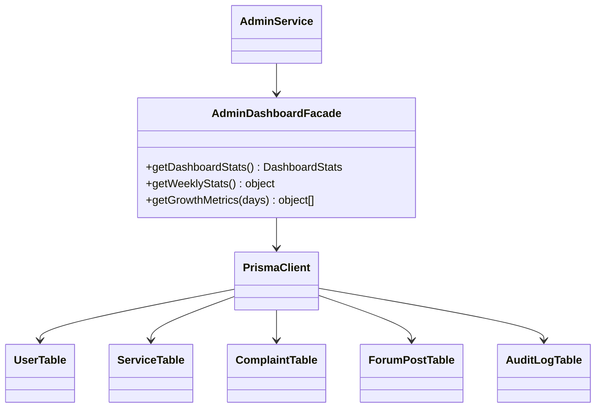

# PolliBondhu — Smart Rural Service Platform

> **Academic Software Engineering Project** · Metropolitan University · SWE-382

PolliBondhu (পল্লীবন্ধু, *Friend of the Village*) is a full-stack platform for rural communities in Bangladesh. It combines citizen services, agriculture support, local providers, complaints, community activity, notifications, and role-based administration.

This root README is the GitHub-facing project overview. The application implementation is in [`pollibondhu/`](./pollibondhu); its detailed technical README is retained unchanged.

## Instructor quick review

| Requirement | Evidence |
| --- | --- |
| Individual implementation | An independently built PolliBondhu project with its own UI, API, data model, patterns, and tests. |
| Five design patterns | Singleton, Factory Method, Strategy, Observer, and Facade—documented below with source links and UML. |
| Automated testing | Jest, ts-jest, Supertest, and mocked Prisma/external dependencies. |
| Coverage evidence | `npm test` produces a Jest/Istanbul report; current verified values are reported truthfully below. |

## Features

- JWT authentication, bcrypt password hashing, validation, and database-driven RBAC
- Public, citizen, officer, provider, and administrator experiences
- Services, bookings, applications, complaints, notifications, audit logs, and dashboards
- Community posts, comments, reactions, polls, and real-time messaging
- Agriculture, education, NGO, emergency, and government-service modules

## Architecture



Routes define endpoints; middleware applies shared HTTP rules; controllers manage request/response work; services contain business logic; repositories isolate data access; and Prisma manages persistence.

## Technology stack

| Area | Technology |
| --- | --- |
| Frontend | React 18, TypeScript, Vite, Tailwind CSS, React Router, TanStack Query |
| Backend | Node.js, Express, TypeScript, Socket.IO |
| Data | Prisma ORM with PostgreSQL or SQLite |
| Security | JWT, bcryptjs, Helmet, CORS, rate limiting, Zod |
| Testing | Jest, ts-jest, Supertest, jest-mock-extended |
| Logging | Winston |

## Performance

Route pages are loaded with React `lazy()` and `Suspense`, so visitors download the code for a page only when they navigate to it. A verified production build reduced the initial JavaScript bundle from **1.22 MB** to **377 KB** (about **69% smaller**), while preserving all routes and behavior.

## Design-pattern deliverable

All patterns are implemented in [`pollibondhu/backend/src/patterns/`](./pollibondhu/backend/src/patterns/) and tested in [`pollibondhu/backend/tests/unit/patterns/`](./pollibondhu/backend/tests/unit/patterns/).

### 1. Singleton — shared database and logger

**Problem:** Creating a Prisma client per request wastes connections, and independent loggers create inconsistent output.

**Files/classes:** [`DatabaseManager`](./pollibondhu/backend/src/patterns/singleton/DatabaseManager.ts) and [`Logger`](./pollibondhu/backend/src/patterns/singleton/Logger.ts). They provide one shared Prisma client and one shared Winston logger to application modules.



Private constructors prevent direct construction. Static `getInstance()` methods lazily create then reuse each shared object.

### 2. Factory Method — notification creation

**Problem:** Creating in-app, email, and system notifications in every service would duplicate channel-specific conditional logic.

**Files/classes:** [`NotificationFactory`](./pollibondhu/backend/src/patterns/factory/NotificationFactory.ts), `Notification`, `InAppNotification`, `EmailNotification`, and `SystemAnnouncement`. The observer workflow uses this factory for service-approval notifications.



Callers request a type and receive the common `Notification` abstraction, avoiding direct dependencies on concrete notification channels.

### 3. Strategy — pluggable search behavior

**Problem:** Services, crops, and experts require different filters, joins, and sorting. One monolithic search implementation would be hard to extend safely.

**Files/classes:** [`SearchStrategy.ts`](./pollibondhu/backend/src/patterns/strategy/SearchStrategy.ts) defines `SearchStrategy<T>`, `SearchContext`, `ServiceSearchStrategy`, `CropSearchStrategy`, and `ExpertSearchStrategy`. [`service.controller.ts`](./pollibondhu/backend/src/controllers/service.controller.ts) uses the service strategy.



The context can switch search behavior without changing callers; each strategy owns query rules for just one entity type.

### 4. Observer — event-driven notifications and auditing

**Problem:** A service approval, complaint resolution, or community event can trigger several independent side effects. Coupling services directly to every side effect makes change risky.

**Files/classes:** [`NotificationSubject.ts`](./pollibondhu/backend/src/patterns/observer/NotificationSubject.ts), `UserNotificationObserver`, and `AuditLogObserver`. Events are emitted from [`service.service.ts`](./pollibondhu/backend/src/services/service.service.ts), [`complaint.service.ts`](./pollibondhu/backend/src/services/complaint.service.ts), and [`application.service.ts`](./pollibondhu/backend/src/services/application.service.ts).



The subject broadcasts an event to attached observers. A later observer, such as an SMS sender, can be added without editing existing business services.

### 5. Facade — administrative dashboard aggregation

**Problem:** The administrator dashboard needs users, services, posts, complaints, and audit records. Controllers should not coordinate every query themselves.

**Files/classes:** [`AdminDashboardFacade`](./pollibondhu/backend/src/patterns/facade/AdminDashboardFacade.ts) provides dashboard statistics, weekly statistics, and growth metrics. [`admin.service.ts`](./pollibondhu/backend/src/services/admin.service.ts) delegates dashboard work to it.



The facade gives the rest of the application a small dashboard API while hiding multi-table aggregation.

## Testing and quality assurance

### Approach

- **Framework:** Jest with `ts-jest`; API integration tests use Supertest.
- **Isolation:** [`tests/setup.ts`](./pollibondhu/backend/tests/setup.ts) swaps the database singleton for a `jest-mock-extended` Prisma mock. Unit tests mock hashing, JWT, and logger dependencies where needed.
- **Coverage:** Jest collects coverage from backend TypeScript source and writes the report to `pollibondhu/backend/coverage/`.
- **Scope:** Tests cover patterns, services, repositories, utilities, middleware, controllers, and integration paths.

### Verified test run

```bash
cd pollibondhu/backend
npm test -- --runInBand
```

| Result | Verified status |
| --- | --- |
| Test suites | 19 passed / 19 total |
| Tests | 140 passed / 140 total |
| Pattern files (line coverage) | 100% for all five pattern implementations |
| Whole-backend line coverage | 38.59% |
| Whole-backend branch coverage | 22.51% |

> **Course target: ≥80% line and branch coverage for backend logic.** The suite is passing, but that overall target has not yet been reached: several controllers, routes, and services need additional focused tests. The current global Jest threshold is 50% in [`jest.config.js`](./pollibondhu/backend/jest.config.js), and the measured run is below it. This is stated explicitly rather than presenting an unsupported coverage claim.

## Project structure

```text
Pollibondhu/
├── README.md                         # GitHub-facing overview (this file)
├── docs/                             # Supporting documentation
└── pollibondhu/
    ├── README.md                     # Detailed technical notes (retained)
    ├── backend/
    │   ├── src/patterns/             # Five documented patterns
    │   ├── src/controllers/          # HTTP handlers
    │   ├── src/services/             # Business logic
    │   ├── src/repositories/         # Data access abstractions
    │   ├── prisma/                   # Schema and seed data
    │   └── tests/                    # Unit, pattern, and integration tests
    └── frontend/src/                 # React UI, contexts, pages, routes
```

## Local setup

### Prerequisites

- Node.js 18+
- npm
- PostgreSQL, or a configured SQLite development database

### Backend

```bash
cd pollibondhu/backend
npm install
cp .env.example .env
npx prisma generate
npx prisma migrate dev
npm run dev
```

### Frontend

```bash
cd pollibondhu/frontend
npm install
npm run dev
```

The frontend normally runs on `http://localhost:5173`; the backend API normally runs on `http://localhost:4000`.

## Submission checklist

- [x] Five software design patterns implemented and documented with UML
- [x] Pattern unit tests and API integration tests included
- [x] Dependency mocking/stubbing used for unit isolation
- [x] GitHub-facing overview contains architecture, features, setup, and source evidence
- [ ] Raise backend line and branch coverage to at least 80% before final submission

## License

Academic project for SWE-382, Metropolitan University.
