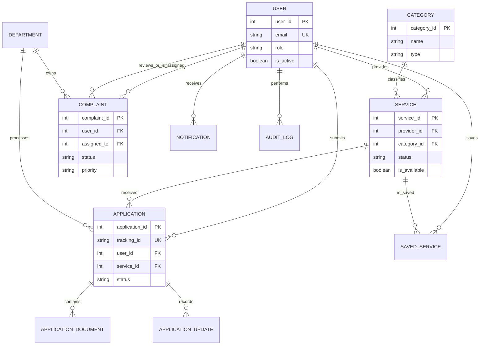
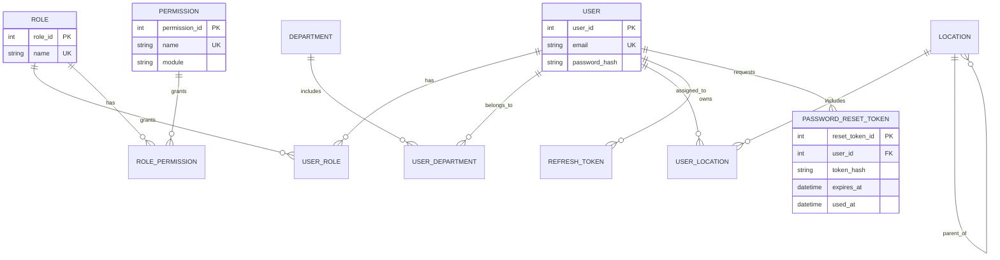
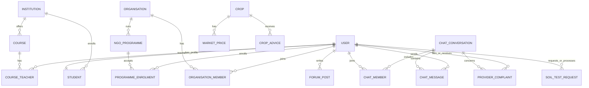

# PolliBondhu Entity Relationship Diagram

This ERD reflects the Prisma schema in `pollibondhu/backend/prisma/schema.prisma` and is the reference for the next implementation phases. It groups the full schema into readable domain diagrams; the Prisma schema remains the source of truth.

## Core services and civic workflows

## RBAC, geography, and account security

## Community, chat, education, NGO, and agriculture

## Implementation sequence

1. **Identity and RBAC:** secure reset tokens, normalize public registration to real roles, and enforce ownership/assignment.
2. **Civic workflow:** application assignment, allowed status transitions, document ownership, and complaint lifecycle.
3. **Service marketplace:** moderation history, approved-only visibility, provider resubmission, and saved services.
4. **Supporting modules:** chat, community, education, NGO, agriculture, and marketplace end-to-end tests.
