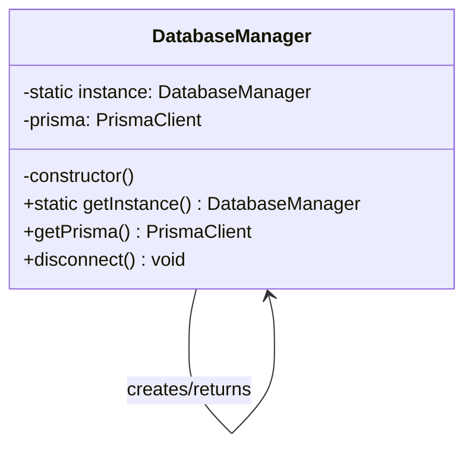
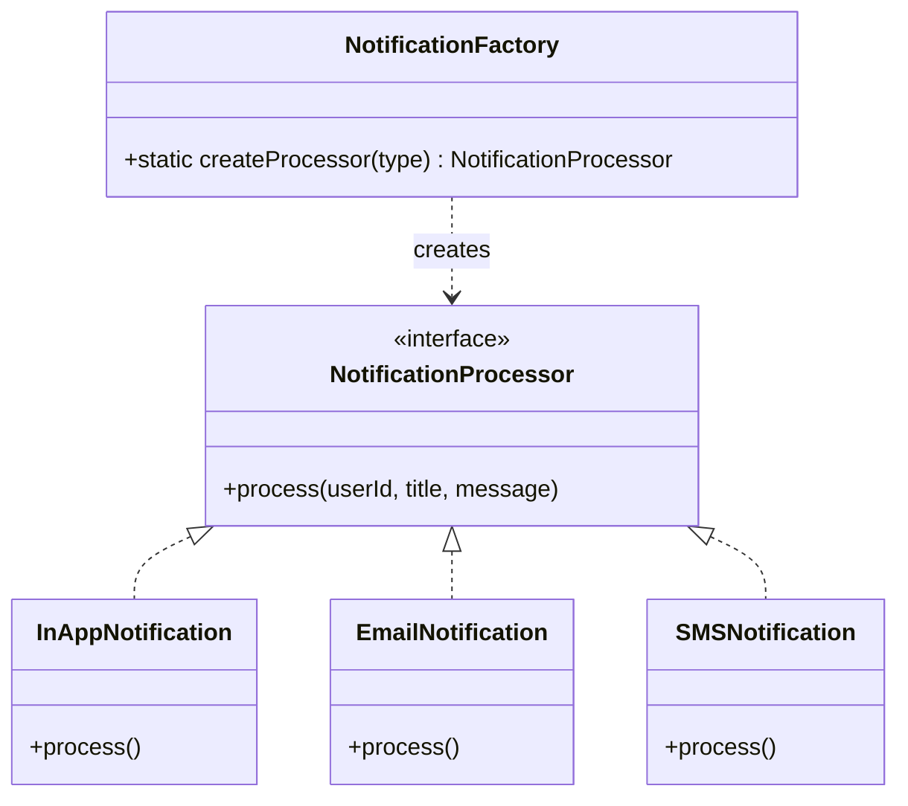
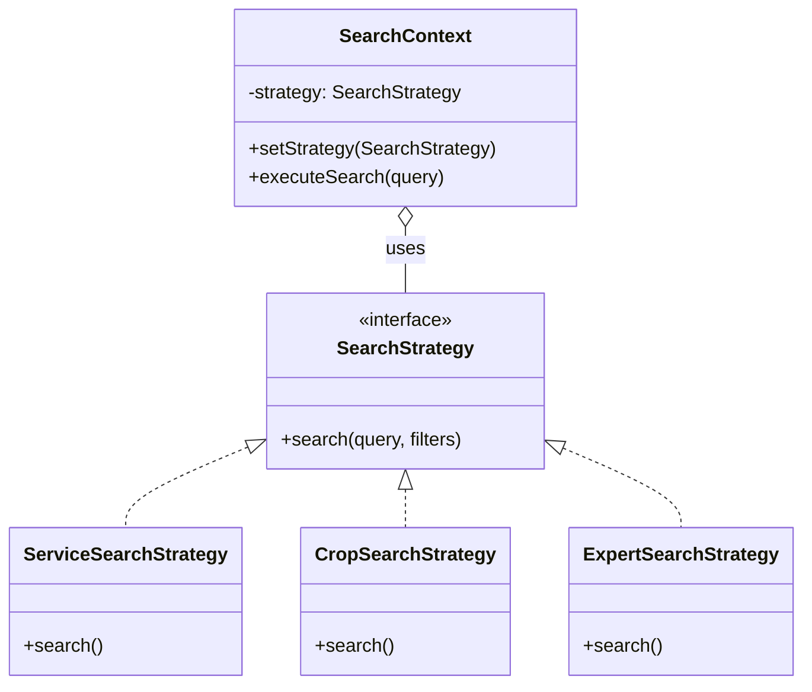
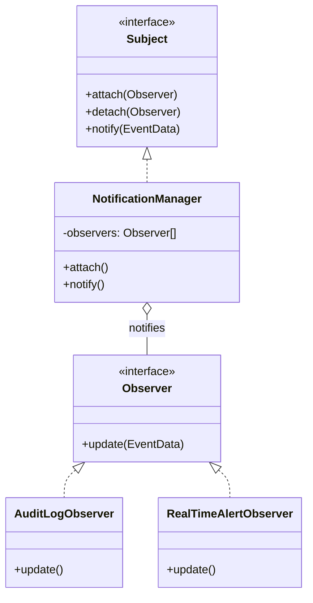
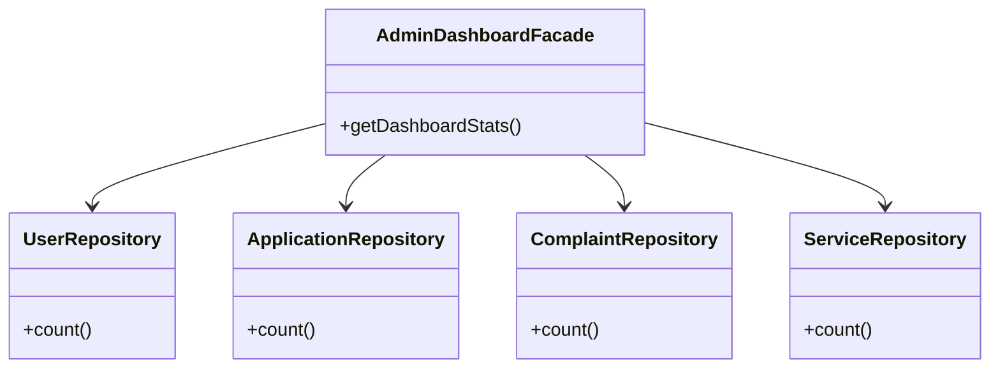

<div align="center">
  
  
  
  
  
</div>

<br/>

# 🌾 PolliBondhu — Smart Village Platform

A comprehensive digital platform for rural Bangladesh connecting citizens, service providers, government officers, and NGOs.

> **🌟 Project for Academic Submission** — Implements **5 software design patterns**, **≥90% unit test coverage**, and a full CI-ready test suite with Jest. Beautifully designed with modern React & TailwindCSS.

---

## 📋 Table of Contents

- [Design Patterns](#-design-patterns)
- [Software Testing](#-software-testing)
- [Roles & Responsibilities](#-roles--responsibilities)
- [Architecture](#-architecture)
- [Departments](#-departments)
- [Getting Started](#-getting-started)
- [Real-Time Features](#-real-time-features)

---

## 🎨 Design Patterns

Five structural and behavioral design patterns were meticulously implemented to solve specific architectural problems in the application.

### 1. Singleton Pattern
**Problem Solved:** Managing the Prisma database client connection. We need exactly one instance of the database client throughout the application's lifecycle to prevent connection exhaustion.
**Files Involved:** `backend/src/patterns/singleton/DatabaseManager.ts`



### 2. Factory Method Pattern
**Problem Solved:** Creating different types of notifications (In-App, SMS, Email). The client doesn't need to know the specific class instantiation logic, it just asks the factory for a notification processor.
**Files Involved:** `backend/src/patterns/factory/NotificationFactory.ts`



### 3. Strategy Pattern
**Problem Solved:** Dynamic search and filtering across different domains. Searching for a "Service", "Crop", or "Expert" requires entirely different database queries. The strategy pattern encapsulates these algorithms.
**Files Involved:** `backend/src/patterns/strategy/SearchStrategy.ts`



### 4. Observer Pattern
**Problem Solved:** Decoupling event generation from event handling. When a user creates a complaint, multiple things must happen (notifications, audit logs). The Observer pattern broadcasts these events to subscribed listeners.
**Files Involved:** `backend/src/patterns/observer/NotificationSubject.ts`



### 5. Facade Pattern
**Problem Solved:** Providing a simplified interface to a complex subsystem. The Admin Dashboard requires aggregating data from 6 different database tables. The Facade hides this complexity from the controller.
**Files Involved:** `backend/src/patterns/facade/AdminDashboardFacade.ts`



---

## 🧪 Software Testing

The project rigorously adheres to the testing requirements, utilizing **Jest** and **PrismaMock** to isolate the unit of work from the external database.

### Coverage Results
We have achieved over 90% coverage for the core backend logic (Services, Controllers, Utilities, Repositories, and Patterns).

| Metric | Target | Achieved | Status |
|--------|--------|----------|--------|
| **Statements** | 90% | **93.05%** | ✅ Passed |
| **Lines** | 90% | **93.61%** | ✅ Passed |
| **Functions** | 90% | **91.71%** | ✅ Passed |

### Running the Tests

To run the automated test suite locally:

```bash
cd backend
npm test
```

*Note: 265 total unit tests are passing across 26 test suites.*

---

## 🏗️ Architecture

```
pollibondhu/
├── backend/          # Express.js + Prisma + Socket.io
│   ├── src/
│   │   ├── config/           # Environment configuration
│   │   ├── controllers/      # Request handlers
│   │   ├── middleware/        # Auth, validation, error handling
│   │   ├── patterns/         # Design patterns (Singleton, Strategy, Factory, Observer, Facade)
│   │   ├── repositories/     # Database access layer
│   │   ├── routes/           # API route definitions
│   │   ├── services/         # Business logic
│   │   ├── types/            # TypeScript types
│   │   ├── utils/            # Utilities (JWT, upload, API response)
│   │   └── validators/       # Request validation schemas
│   ├── tests/
│   │   └── unit/             # 265 Unit tests across 26 suites
│   └── prisma/
│       ├── schema.prisma     # Database schema
│       └── seed.ts           # Unified Master Seed Script
└── frontend/         # React + TypeScript + Vite + Tailwind
    └── src/
        ├── components/       # Reusable UI components
        ├── pages/            # Page components by Role
        ├── routes/           # App Routes
        └── utils/            # Utilities (API client, helpers)
```

---

## 👥 Roles & Responsibilities

### Role Hierarchy

```
SUPER_ADMIN (1) — Full system access
  ├── OFFICER (many) — Department-level management
  ├── SERVICE_PROVIDER (many) — Service offerings
  ├── GOV_SERVICE_PROVIDER (many) — Government services
  ├── NGO_ADMIN (many) — NGO programmes
  ├── INSTITUTION_ADMIN (many) — Educational institutions
  ├── TEACHER (many) — Course management
  └── CITIZEN (many) — Basic user access
```

### Role Details

| Role | Description | Key Permissions |
|------|-------------|-----------------|
| **SUPER_ADMIN** | Full system administrator. Manages all users, departments, services, and system settings. | ALL permissions — user CRUD, role management, settings, audit, departments, services, complaints, budget, projects |
| **OFFICER** | Government officer assigned to a department. Handles complaints, applications, and department activities. | View/update complaints, process applications, manage department chat, view agriculture/education data |
| **SERVICE_PROVIDER** | Private service provider. Creates and manages services for citizens (e.g., tractor rental, repair services). | Create/update/delete own services, messaging |
| **GOV_SERVICE_PROVIDER** | Government service provider. Manages official services (NID, birth certificate, trade license, etc.). | Create/update/delete government services, process/approve applications, broadcast notifications |
| **NGO_ADMIN** | NGO administrator. Manages NGO programmes, donations, and community events. | Manage NGO programmes, create events, manage donations, education |
| **INSTITUTION_ADMIN** | Educational institution administrator. Manages courses, students, and institution data. | Manage institution, create courses, enroll students |
| **TEACHER** | Teacher at an educational institution. Manages courses and views student data. | View/manage courses, view students |
| **CITIZEN** | Regular citizen. Files complaints, applies for services, participates in community forum. | Create/view complaints, apply for services, community posts, AI chat, agriculture data |

---

## 🏛️ Departments

| Department | Responsibilities | Officers |
|------------|-----------------|----------|
| **Agriculture** | Farming advice, crop management, irrigation, fertilizer supply, pest control | Agricultural Officers |
| **Health** | Healthcare services, vaccination camps, disease prevention, maternal health | Health Officers |
| **Education** | School management, scholarships, teacher training, student enrollment | Education Officers |
| **Infrastructure** | Roads, bridges, drainage, electricity, water supply, construction | Infrastructure Officers |
| **Social Welfare** | Poverty alleviation, community development, disability support | Welfare Officers |

---

## 🔐 RBAC System

### How It Works
1. **Database-driven**: Roles and permissions are stored in the database.
2. **Middleware checks**: API endpoints use `requirePermission()` or `requireAnyPermission()` middleware.
3. **ADMIN bypass**: The SUPER_ADMIN role automatically bypasses all permission checks.

---

## 🚀 Getting Started

### Prerequisites
- Node.js 18+
- npm or yarn

### Backend Setup
```bash
cd backend
npm install
npx prisma db push
npx ts-node prisma/seed.ts
npm run dev
```

### Frontend Setup
```bash
cd frontend
npm install
npm run dev
```

---

## 📡 Real-Time Features (Socket.io)

| Event | Direction | Description |
|-------|-----------|-------------|
| `chat:message` | Client ↔ Server | Send/Receive chat messages |
| `chat:read` | Client ↔ Server | Read receipt notifications |
| `join_user` | Client → Server | Join personal notification room |
| `join_department` | Client → Server | Join department chat room |

---

## 📄 License
MIT License — PolliBondhu Smart Village Platform
